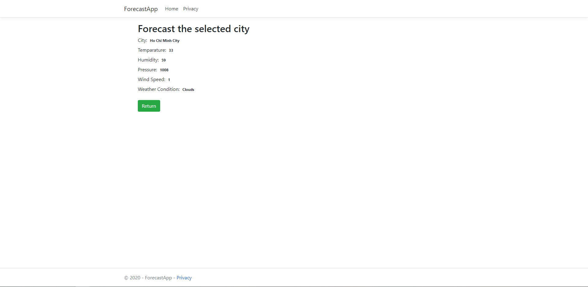

<div align="center">

# ForecastApp



</div>

# Description

> ForecastApp is a weather forecast webapp which provides weather information of a city such as temparature, wind speed, humidity.

> ForecastApp uses [Open Weather MAP](https://openweathermap.org) API to get the aforementioned data.

# Example

```code
http://api.openweathermap.org/data/2.5/weather?q=Ha%20Noi&units=metric&APPID=[API_KEY]
```

```code
{
    "coord": {
        "lon": 105.84,
        "lat": 21.02
    },
    "weather": [
        {
            "id": 801,
            "main": "Clouds",
            "description": "few clouds",
            "icon": "02d"
        }
    ],
    "base": "stations",
    "main": {
        "temp": 35,
        "feels_like": 37.37,
        "temp_min": 35,
        "temp_max": 35,
        "pressure": 1004,
        "humidity": 50
    },
    "visibility": 10000,
    "wind": {
        "speed": 4.1,
        "deg": 110
    },
    "clouds": {
        "all": 20
    },
    "dt": 1595586215,
    "sys": {
        "type": 1,
        "id": 9308,
        "country": "VN",
        "sunrise": 1595543238,
        "sunset": 1595590720
    },
    "timezone": 25200,
    "id": 1581130,
    "name": "Hanoi",
    "cod": 200
}
```

# Install

```code
docker pull quocthinhluu97/forecastapp
```

# Usage

```code
docker run -p 4000:80 -d quocthinhluu97/forecastapp
```
> The above command will run a container with the mentioned image and publish port 80 from the inside to port 4000 on localhost

# License

[](http://badges.mit-license.org)

- **[MIT license](http://opensource.org/licenses/mit-license.php)**
- Copyright 2020 © ForecastApp